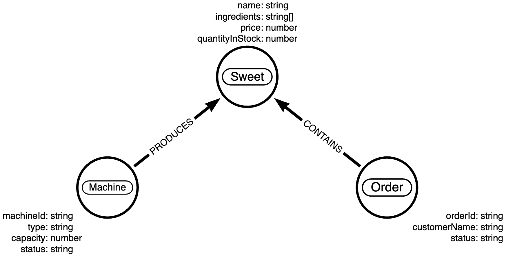

# neo4j-sweet-management

This repo contains a Typescript, Node.js GraphQL server that uses a Neo4j database.

The application contains the following entities:

- Sweets
- Machines
- Orders

Consumers of the GraphQL API can perfom various operations on the entities such as:

- Create a sweet
- Create a machine
- Create an order
- Add a sweet to a machine
- Add an sweet to a order
- List sweets

Here is the data model for the application:



## Getting Started

### Requirements

1. Node.js v18
2. Docker v24

### Starting Neo4j

This API connects to Neo4j, therefore you first need to run a local instance of Neo4j.

```shell
docker run -d \
    --name neo4j-container \
    -p 7474:7474 \
    -p 7687:7687 \
    -e NEO4J_AUTH=neo4j/super-strong-password-123 \
    neo4j:latest
```

### Installing dependencies

Now that Neo4j is running locally, you can install the dependencies for the API.

```bash
npm i
```

### Setting up the environment variables

The API uses environment variables to connect to Neo4j. You can set these variables by creating a `.env` file in the root of the project.

```bash
HTTP_PORT=3000
NEO4J_URI=bolt://localhost:7687
NEO4J_USER=neo4j
NEO4J_PASSWORD=super-strong-password-123
```

### Starting the API

Now that the dependencies are installed, you can start the API.

```bash
npm run dev
```

```
neo4j-sweet-management@1.0.0 dev
> DEBUG="sweet:management" NODE_ENV=development ts-node ./src/index.ts

  sweet:management Starting application +0ms
  sweet:management Connecting to Neo4j +1ms
  sweet:management Connected to Neo4j Server localhost:7687 +27ms
  sweet:management Starting app +1ms
  sweet:management Server Online  3000 +0ms
  sweet:management GraphQL Playground: http://localhost:3000/graphql +0ms
  sweet:management Application started +0ms
```

In dev you can use the GraphQL playground to test the API. You can access the playground at `http://localhost:3000/graphql`.

### Testing the API

You can test the API by running the following command:

```bash
npm run test
```

```
Test Suites: 7 passed, 7 total
Tests:       15 passed, 15 total
Snapshots:   0 total
```
